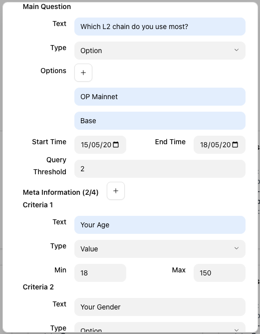
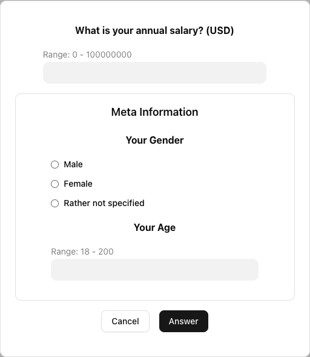
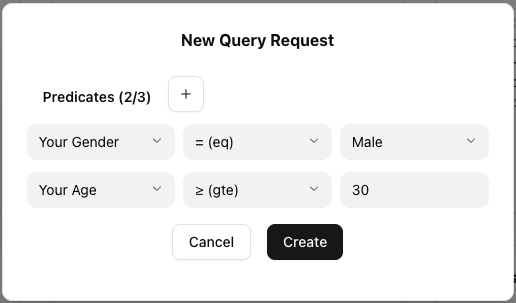
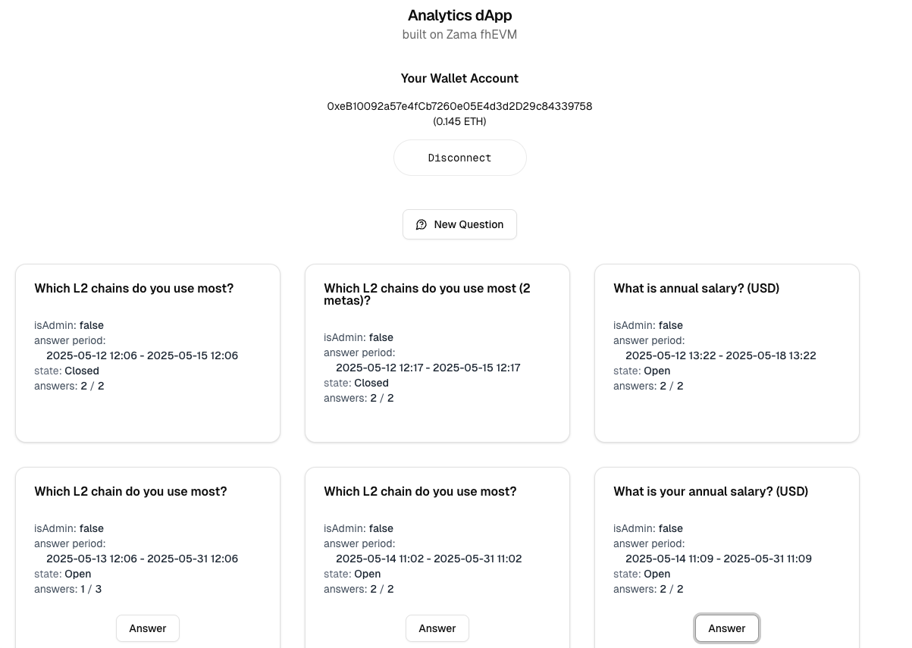

# Analytics dApp built on Zama fhEVM

## Project Artifacts

- 🌐 [Project website](https://analytics-zama.vercel.app)
- 📜 Smart Contracts
  - **Analytic.sol**: [0x5366a157ca0FD369B843Acd1CfB15f31B541ccF3](https://sepolia.etherscan.io/address/0x5366a157ca0FD369B843Acd1CfB15f31B541ccF3#code) on Sepolia
  - **QuestionSpecLib.sol**: [0x0Ea37D3264b940C94D68DA1EB34C291D62Ba8Ab5](https://sepolia.etherscan.io/address/0x0Ea37D3264b940C94D68DA1EB34C291D62Ba8Ab5#code) on Sepolia
- 🎥 [Demo Video](https://www.loom.com/share/13061bce424e4bed9d7f7551d3f5f33d) - watch this first (at 1.2x speed) for a quick overview of the project and its features.
- 📝 [Writeup](http://jimmychu0807.hk/analytics-zama)

## Overview

This repo is a solution for Zama Bounty Season 8: [Build a Confidential Benchmarking and Polling System On-chain](https://github.com/zama-ai/bounty-program/issues/144)

This confidential polling dApp offers the following features:

1. The question creator can define a question set consisting of a **main** question and up to four **meta** questions. Each question can be either an option where the respondent selects one choice, or a value with specified minimum and maximum bounds.

   **Example 1**:
   - Main: Which L2 chain do you use most? (options: OP Mainnet, Base, Arbitrum, Zk Sync).
   - Meta 1: Your Gender (option: male, female)
   - meta 2: Your Age (value: 18 - 150)

   **Example 2**:
   - Main: What is your annual salary (USD)? (value: 0 - 100,000,000)
   - Meta 1: Your Gender (option: male, female)

   In practice, the meta question is capped to four in the application.

   

2. Respondent answer sets are encrypted client-side before being sent on-chain. The encrypted answer set is [validated](https://github.com/jimmychu0807/analytics-dapp-zama/blob/9adb191f8359d95b3d5e0ab30ca039461542d747/packages/hardhat/contracts/Analytic.sol#L173-L187) by the smart contract to ensure values fall within the specified range, leveraging [**Fully Homomorphic Encryption**](https://mirror.xyz/privacy-scaling-explorations.eth/D8UHFW1t48x2liWb5wuP6LDdCRbgUH_8vOFvA0tNDJA) provided by the [fhEVM library](https://www.zama.ai/products-and-services/fhevm). After validation, the [validity flag](https://github.com/jimmychu0807/analytics-dapp-zama/blob/9adb191f8359d95b3d5e0ab30ca039461542d747/packages/hardhat/contracts/Analytic.sol#L209) (a boolean) is decrypted. If the answer set is valid, it is stored on-chain.

   

3. When a question set reaches its query threshold, the question creator can raise a **Query Request** with zero or multiple predicates. If the **main** question is an **Option** type, all matching answers are tallied and displayed. If the **main** question is a **Value** type, the system computes the minimum, sum, and maximum. A **predicate** can apply to any **meta** question, using operators such as equal, not equal, greater than or equal, or less than or equal.

   

4. After a **Query Request** is created, the question creator must execute the query request to process the answers. This involves [accumulating FHE-encrypted answer values](https://github.com/jimmychu0807/analytics-dapp-zama/blob/9adb191f8359d95b3d5e0ab30ca039461542d747/packages/hardhat/contracts/Analytic.sol#L315-L324), which can be gas-intensive. A `steps` parameter specifies how many answers to process at a time, writing intermediate results to storage. In practice, processing 5 - 8 answers per step balances execution count with the 3,000,000 FHE gas limit per block.

   Once a Query Request is fully processed, the result is [re-encrypted and decrypted](https://docs.zama.ai/fhevm/smart-contract/decryption/reencryption) client-side.

   For more details on data structures and development approach, see:

   - [**hardhat**](./packages/hardhat) package - refer to [Development Approach](./packages/hardhat/README.md#development-approach) for details.
   - [**web**](./packages/web) package

## Development

To run the project locally:

```sh
cd /project-folder

# Install all the dependencies
pnpm install

# Setup the .env files
cp .env.dev .env
cd packages/hardhat
ln -sf .env ../../.env
cd ../web
ln -sf .env ../../.env
cd ../..

# Build the frontend
pnpm build
# Build the smart contract and run unit tests
pnpm test
# Kickstart a hardhat node, fhEVM mock server, and the web front end
pnpm dev
```

Visit http://localhost:3010 to view the app.


