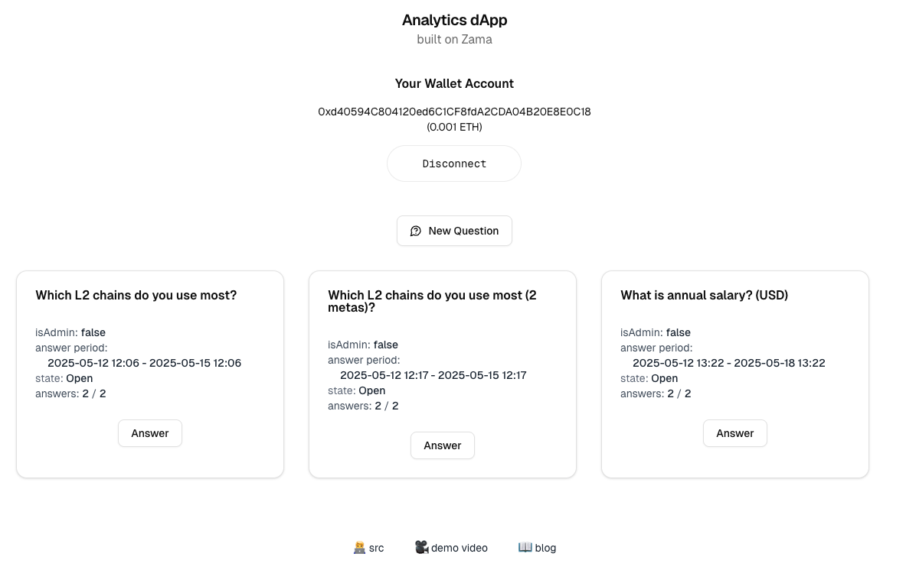

# Analytics dApp built on Zama fhEVM

## Overview

This repo is a solution to Zama Bounty Season 8: [Build a Confidential Benchmarking and Polling System On-chain](https://github.com/zama-ai/bounty-program/issues/144)

- Project: https://analytics-zama.vercel.app/
- Smart Contracts:
  - [Analytic.sol](./packages/hardhat/contracts/Analytic.sol): [0x5366a157ca0FD369B843Acd1CfB15f31B541ccF3](https://sepolia.etherscan.io/address/0x5366a157ca0FD369B843Acd1CfB15f31B541ccF3#code) on Sepolia
  - [QuestionSpecLib.sol](./packages/hardhat/contracts/QuestionSpecLib.sol): [0x0Ea37D3264b940C94D68DA1EB34C291D62Ba8Ab5](https://sepolia.etherscan.io/address/0x0Ea37D3264b940C94D68DA1EB34C291D62Ba8Ab5#code) on Sepolia
- [Demo Video](https://www.loom.com/share/d56411748acd44c0a61d4f2e6715be69)

This is a confidential polling dApp that has the following features:

1. The surveyer can create a question set consists of a **main** question together with multiple **meta** questions, and each question can be either an option that allow answerer to pick one of the option or a value with a min and max range bound. An example of the question set would be:

  Example 1:
  - main: Which L2 chain do you use most? (option: OP Mainnet, Base, Arbitrum, Zk Sync).
  - meta 1: Your Gender (option: male, female)
  - meta 2: Your Age (value - min: 18, max: 150)

  Example 2:
  - main: What is your annual salary (USD)? (value: 0 - 100,000,000)
  - meta1: Your Gender (option: male, female)

  In practice, the meta question is capped to three in the application.

2. Respondent answer sets are encrypted on the client-side before sending on-chain. The encrypted answer set [is checked](https://github.com/jimmychu0807/analytics-dapp-zama/blob/9adb191f8359d95b3d5e0ab30ca039461542d747/packages/hardhat/contracts/Analytic.sol#L173-L187) on the smart contract side to be within the range specified. After the check, we will request the [validity flag](https://github.com/jimmychu0807/analytics-dapp-zama/blob/9adb191f8359d95b3d5e0ab30ca039461542d747/packages/hardhat/contracts/Analytic.sol#L209) (a boolean) to be decrypted. The gateway will send the clear answer back to the smart contract. If the answer set is valid, it will be added to the corresponding storage.

3. Once a question reach its query threshold, a **Query Request** can be raised by the surveyer with possibly multiple filters/predicates (these two terms are used interchangeably). If the **main** question is an **option** type, all the anwers that match the predicate will be tallied up and display. If the **main** question is a **value** type, its (min, mean, max) value will be computed. A **predicate** can be any of the **meta** question to be \[equal, not equal, greater than or equal, less than or equal\] to an option or a value.

4. Once a **Query Request** is created, the surveyer need to execute/process the query request for the query request to process the answers. This involves [intensive accumulation of FHE-encrypted answer values](https://github.com/jimmychu0807/analytics-dapp-zama/blob/9adb191f8359d95b3d5e0ab30ca039461542d747/packages/hardhat/contracts/Analytic.sol#L315-L324) and lot of FHE gas may be consumed, so a `steps` parameter can be specified to determine how many answers to step through at a time and write the intermediate answer back to the storage. In practice, it seems processing 5 - 8 answers at a time is the sweet spot of having a small number of query execution while staying within the bound of 3,000,000 FHE gas limit per block.

  Once a Query Request is fully processed, its query result could be fetched by the client side.

For more details, refer to the readme inside:

- [**hardhat**](./packages/hardhat)
- [**web**](./packages/web)

## Development

Run the following commands to run the project locally

```sh
cd /project-folder

# Install all the dependencies
pnpm install

# Setup the .env files
cp .env.dev .env
cd packages/hardhat
ln -sf .env ../../.env
cd ../web
ln -sf .env ../../.env
cd ../..

# Build the frontend
pnpm build
# Build the smart contract and run unit tests
pnpm test
# Kickstart a hardhat node, fhEVM mock server, and the web front end
pnpm dev
```

Visit http://localhost:3010 to check out the page.


